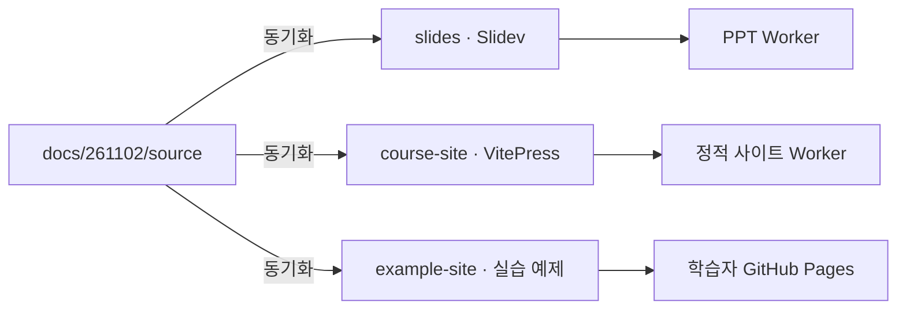

# Git과 웹 배포 수업

## Workers 접속 경로

- 슬라이드: https://hdai.qus0in.workers.dev/git/slides/
- 문서: https://hdai.qus0in.workers.dev/git/docs/

## 프로젝트 구조

```mermaid
flowchart LR
    Source[docs/261102/source] -->|동기화| Slides[slides · Slidev]
    Source -->|동기화| Site[course-site · VitePress]
    Source -->|동기화| Example[example-site · 실습 예제]
    Slides --> PPT[PPT Worker]
    Site --> Web[정적 사이트 Worker]
    Example --> Pages[학습자 GitHub Pages]
```
